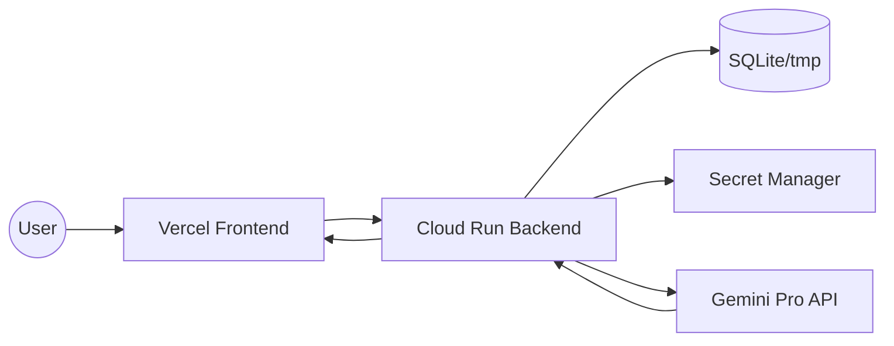

# AI Coding Mentor 🚀
### A Socratic AI Partner for Modern Software Engineering

[](https://fastapi.tiangolo.com/)
[](https://reactjs.org/)
[](https://cloud.google.com/)
[](https://vercel.com/)
[](https://opensource.org/licenses/MIT)

AI Coding Mentor is a production-grade SaaS application designed to help developers level up through Socratic guidance. Unlike traditional AI chatbots that simply provide answers, this mentor identifies logic gaps, explains complex architectural patterns, and provides structured, actionable feedback using the Gemini Pro engine.

---

## 🌟 Key Features

- **🧠 Socratic Mentoring:** Uses pedagogical prompting to help developers solve problems themselves rather than spoon-feeding code.
- **📊 Structured AI Responses:** Returns precise JSON-formatted turns including "Thinking Process," "Takeaways," and "Code Implementation."
- **💻 Premium Code Rendering:** Syntax-highlighted code cards with copy-to-clipboard functionality and dark-mode optimization.
- **🔄 Async Backend Architecture:** Built on FastAPI's async runtime for high-concurrency and non-blocking AI orchestration.
- **💾 Session Memory:** Persistent conversation state managed via SQLAlchemy and SQLite for continuous learning.
- **☁️ Production Cloud Stack:** Fully containerized backend deployed on Google Cloud Run with secure secret management.

---

## 🛠 Tech Stack

### Frontend
| Technology | Usage |
| :--- | :--- |
| **React 18** | UI Library & Component Architecture |
| **Vite** | Modern Build Tooling & HMR |
| **Tailwind CSS** | Utility-First Styling & Responsive Design |
| **TypeScript** | Type-Safe State & API Integration |
| **Lucide React** | Premium Iconography |

### Backend
| Technology | Usage |
| :--- | :--- |
| **FastAPI** | High-Performance Async Web Framework |
| **Gemini 3.1** | Advanced LLM for Logic & Reasoning |
| **SQLAlchemy** | Async ORM for Persistent Memory |
| **Pydantic V2** | Robust Data Validation & Settings |
| **Uvicorn** | ASGI Server for Production Deployment |

### Cloud & DevOps
| Technology | Usage |
| :--- | :--- |
| **Google Cloud Run** | Serverless Container Hosting |
| **Google Secret Manager** | Secure API Key & Credential Storage |
| **Vercel** | Edge-Optimized Frontend Deployment |
| **Docker** | Multi-Stage Production Build |
| **Cloud Build** | CI/CD Pipeline for Container Registry |

---

## 📐 System Architecture

The application follows a clean, decoupled architecture optimized for scalability and latency.



---

## 📸 UI Preview

| Landing Page | Mentor Chat |
| :---: | :---: |
|  |  |

---

## 🚀 Local Development

### 1. Prerequisites
- Node.js (v18+)
- Python 3.12+
- Gemini API Key

### 2. Backend Setup
```bash
cd backend
python -m venv venv
source venv/bin/activate  # venv\Scripts\Activate.ps1 on Windows
pip install -r requirements.txt
cp .env.example .env  # Add your GEMINI_API_KEY
uvicorn app.main:app --reload --port 8080
```

### 3. Frontend Setup
```bash
cd frontend
npm install
# Create .env with: VITE_API_BASE_URL=http://localhost:8080
npm run dev
```

---

## 📦 Environment Variables

### Backend (`backend/.env`)
```env
APP_NAME="AI Coding Mentor"
ENVIRONMENT="development"
GEMINI_API_KEY="sk-..."
DATABASE_URL="sqlite+aiosqlite:///./mentor_agent.db"
```

### Frontend (`frontend/.env`)
```env
VITE_API_BASE_URL="http://localhost:8080"
```

---

## 🚢 Cloud Deployment

### Backend (Cloud Run)
The backend is containerized and deployed to Google Cloud Run.
- **Registry:** Artifact Registry (us-central1)
- **Secrets:** Bound via Secret Manager
- **Scaling:** Autoscaling 0 to 10 instances

### Frontend (Vercel)
The frontend is deployed to Vercel with edge-caching and automatic SSL.

---

## 📂 Project Structure

```text
ai-coding-mentor/
├── backend/
│   ├── app/
│   │   ├── api/          # Routers & Middleware
│   │   ├── core/         # Config & Logging
│   │   ├── services/     # Gemini & Agent Logic
│   │   └── infrastructure/ # Database & Models
│   ├── Dockerfile        # Multi-stage production build
│   └── requirements.txt
├── frontend/
│   ├── src/
│   │   ├── components/   # UI & CodeCards
│   │   ├── hooks/        # API Integration
│   │   └── types/        # TypeScript Definitions
│   ├── vite.config.ts
│   └── package.json
└── README.md
```

---

## 🔮 Future Roadmap
- [ ] **Streaming Responses:** Implementing Server-Sent Events (SSE) for real-time typing.
- [ ] **Vector Memory:** RAG-based integration for codebase-specific mentoring.
- [ ] **Authentication:** GitHub OAuth integration for personalized progress tracking.
- [ ] **Voice Mentoring:** Web Speech API for hands-free coding sessions.

---

## 👤 Author

**Codernoob000**
- GitHub: [@Codernoob000](https://github.com/Codernoob000)
- Deployment: [ai-coding-mentor.vercel.app](https://ai-coding-mentor.vercel.app)

---

## 📄 License

Distributed under the MIT License. See `LICENSE` for more information.
